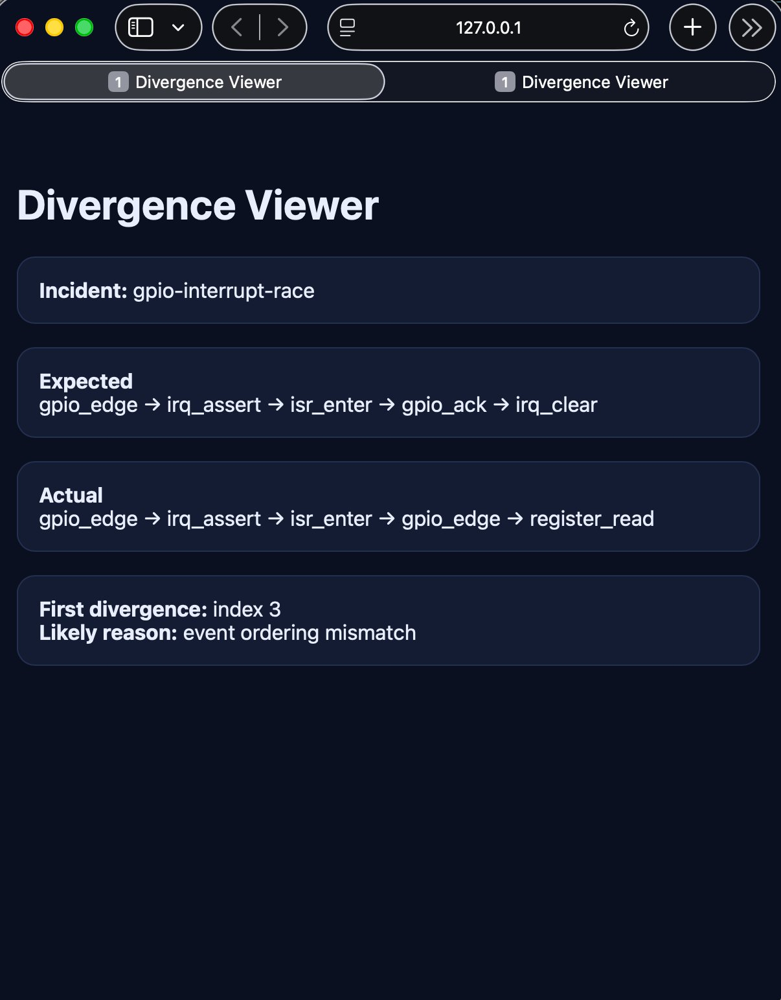
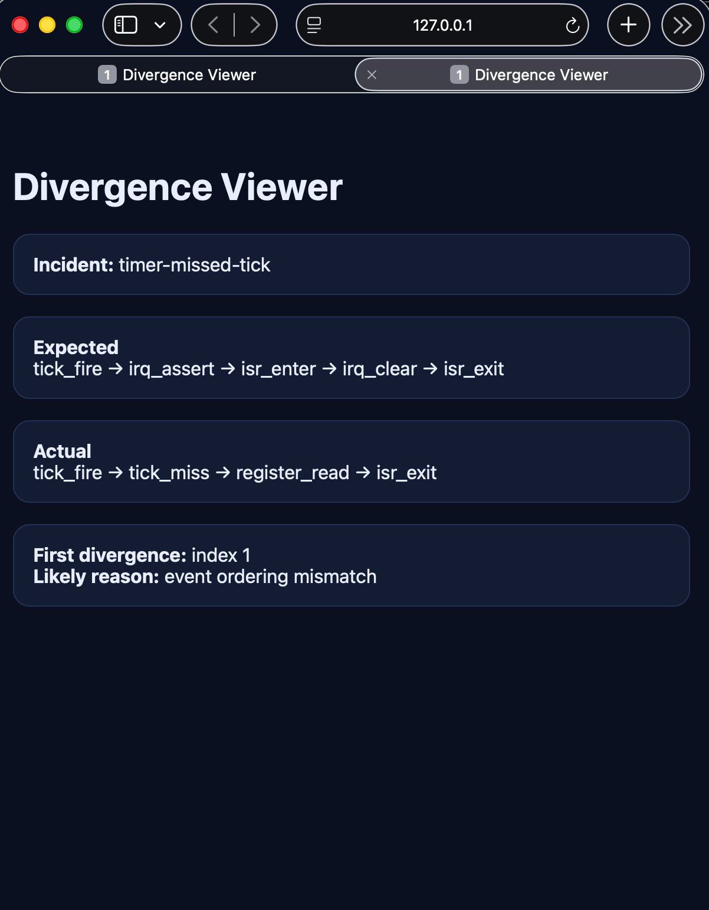

# DetTrace — First-Failure Isolation Through Deterministic Replay

**DetTrace finds the first incorrect event in distributed, concurrent, and firmware-style traces.**

`C++17` · `Swift` · `CMake` · `JSONL artifacts`

---

## Divergence Viewer



*GPIO interrupt race — first divergence at index 3. Expected `gpio_ack`, got `gpio_edge`. The failure appeared downstream as duplicate processing; the root cause was here, before any visible output.*



*Timer missed tick — first divergence at index 1. Expected `irq_assert`, got `tick_miss`. Both are real viewer outputs from the included incident packs.*

Find the first incorrect event across distributed or firmware-style traces. Not the symptom — the cause.

---

## Run in 30 Seconds

```bash
git clone https://github.com/kritibehl/dettrace
cd dettrace
cmake -B build && cmake --build build
./scripts/run_demo.sh                  # deterministic replay
./scripts/serve_viewer.sh              # divergence viewer → http://localhost:8000/viewer/index.html
```

---

## Why This Project Matters in Hiring Terms

- Shows systems debugging depth: deterministic replay, divergence isolation, causal chain reconstruction
- Shows correctness tooling design: event-level replay, cross-run learning, blast-radius inference
- Shows language judgment: C++ for execution engine, Swift actors for race-free analysis
- Relevant to: systems debugging infrastructure, distributed systems, production engineering, firmware-style validation

---

## Proof, Up Front

| Signal | Result |
|---|---|
| First divergence isolated | Event index 5 — task ordering race, before any visible output |
| GPIO interrupt race | First divergence at index 3, event ordering mismatch |
| Timer missed tick | First divergence at index 1, event ordering mismatch |
| Control-loop scenarios diverged | 3 of 4 — sensor at 3.9s, actuator at 5.4s, 5 missed deadlines |
| Cross-incident match confidence | **1.0** on previously-seen failure pattern |
| Analysis layer | Swift actors — race-free analysis of race conditions |

---

## Quick Demo

```bash
cmake -B build && cmake --build build
./scripts/run_demo.sh                    # deterministic replay
./scripts/serve_viewer.sh               # divergence viewer → http://localhost:8000/viewer/index.html
swift run DetTraceAnalyzer ../artifacts/expected.jsonl ../artifacts/actual.jsonl
```

---

## The Problem

Concurrency and distributed failures refuse to reproduce. Add a log statement and the bug disappears. Remove it and it comes back differently. Retries amplify noise. Later symptoms look more important than where the failure actually began.

By the time you have enough data to reason about it, the interleaving that caused it is gone. The standard tooling either requires full syscall capture with significant overhead, or reports lock-order violations without telling you which one produced *this* failure.

DetTrace gives you a named, replayable moment of divergence with downstream impact prediction.

---

## What DetTrace Does

- **Replays** execution deterministically — records as an event sequence, replays identically
- **Isolates** the first divergence — finds the exact event index where behavior stopped matching expectation
- **Fingerprints** failures — classifies into named, stable patterns across runs
- **Diffs** incidents semantically — compares baseline vs candidate at the root-cause level, not raw log mismatch
- **Predicts** propagation — infers downstream failure path from first divergence onward
- **Matches** against history — cross-run similarity search for previously-seen failure patterns
- **Debugs** control loops — replay under sensor, actuator, and timing faults

---

## First Divergence: Distributed Task Race

```
Expected: TASK_DEQUEUED  task=1  worker=0  queue=0
Actual:   TASK_DEQUEUED  task=2  worker=0  queue=0

Divergence at event index 5
```

Two workers competed for the same task. The failure appeared downstream as duplicate processing — but the root cause was at index 5, before any visible output.

```json
{
  "first_divergence_index": 5,
  "divergence_type": "event_mismatch",
  "expected": { "seq": 5, "type": "TASK_DEQUEUED", "task": 1 },
  "actual":   { "seq": 5, "type": "TASK_DEQUEUED", "task": 2 }
}
```

---

## Architecture

```
Record phase
    │
    ▼
Execution event log (expected.jsonl / actual.jsonl)
    │
    ▼
Replay engine (C++17)
    │    ← deterministic: same seed, same interleaving, same output
    ▼
Divergence comparator
    │    ← walks event sequences, stops at first mismatch
    ▼
divergence_report.json
    ├── first_divergence_index
    ├── divergence_type
    └── event context (expected vs actual)
    │
    ▼
Swift analysis layer (actor-isolated)
    ├── Incident fingerprinting
    ├── Propagation prediction
    ├── Semantic incident diff
    └── Cross-incident similarity match
    │
    ▼
Artifact set
    ├── incident_fingerprint.json
    ├── propagation_prediction.json
    ├── distributed_incident_report.json
    └── control_loop_diagnostics_summary.json
```

---

## Control-Loop Results

| Scenario | Stable? | First divergence | Root cause |
|---|---|---|---|
| Healthy | Yes | None | — |
| Delayed sensor | No | Step 38 / 3.9s | Delayed measurement |
| Actuator saturation | No | Step 53 / 5.4s | Actuator saturation |
| Timing jitter | No | Timing-budget failure | 5 missed deadlines |

```json
{
  "first_divergence_step": 38,
  "first_divergence_timestamp": "3.9s",
  "root_cause_class": "delayed_measurement",
  "error_growth_after_divergence": 0.903344,
  "deadline_misses": 5,
  "instability_detected": true
}
```

---

## Distributed Incident Analysis

**Retry storm reconstructed:**
```
dns_failure → retry → transport_reset → retry_burst → downstream_unavailable → timeout_chain
```

```
Client / Edge Proxy
        │
        ▼
   auth-service   ← first failing service
        │
        ▼
     token-db     ← downstream impact

Propagation:
  edge-proxy → auth-service → token-db
                │              ↑
                └── retries ───┘
                       └── eventual timeout
```

```json
{
  "incident_family": "retry_storm",
  "blast_radius": {
    "root_service": "auth-service",
    "directly_impacted_services": ["token-db"],
    "upstream_services": ["edge-proxy"]
  }
}
```

---

## Cross-Incident Learning

```json
{ "incident_fingerprint": "event_mismatch_task_mismatch" }

{
  "predicted_failure_propagation_path": [
    "work_distribution_skew",
    "missed_or_duplicate_processing"
  ]
}

{ "confidence": 1.0, "top_match": "incident_20250301_task_mismatch" }
```

Confidence 1.0: this failure pattern has been seen before. Debugging shifts from "what is this?" to "we've seen this — here's what happened last time."

---

## Comparison With Existing Tools

| | DetTrace | Mozilla rr | Valgrind Helgrind |
|---|---|---|---|
| Approach | Event-level replay + divergence isolation | Full syscall record-and-replay | Lock order + happens-before |
| Incident learning | **Yes** — fingerprint + propagation prediction | No | No |
| Cross-run history | **Yes** | No | No |
| Overhead | Low (application-level) | High (full system capture) | Very high (instrumentation) |
| Output | Structured artifacts + causal chain | Replay binary | Violation reports |
| Control-loop debugging | **Yes** | No | No |

---

## Swift Analysis Layer

C++ for execution. Swift for safe analysis. Actor isolation prevents analysis-time race conditions in the layer that is itself analyzing race conditions.

```swift
actor AnalysisStore {
    private var incidents: [Incident] = []

    func ingest(_ artifacts: ArtifactSet) async throws {
        let fingerprint = try await classify(artifacts.divergenceReport)
        let prediction  = try await predict(fingerprint)
        incidents.append(Incident(fingerprint: fingerprint, prediction: prediction))
    }
}
```

---

## Replayable Incident Packs

| Pack | Failure pattern |
|---|---|
| `cascading_timeouts.jsonl` | Timeout chain across service hops |
| `retry_storm.jsonl` | Retry amplification under dependency failure |
| `misordered_recovery.jsonl` | Recovery events arrive out of causal order |
| `failover_edge.jsonl` | Dependency failover with incomplete blast-radius resolution |

---

## Full Setup

```bash
cmake -B build && cmake --build build
cd build && ctest --output-on-failure

./scripts/run_demo.sh
./scripts/run_distributed_demo.sh
./scripts/run_control_loop.sh
./scripts/run_incident_intelligence.sh
./scripts/serve_viewer.sh               # → http://localhost:8000/viewer/index.html

cd dettrace-swift
swift run DetTraceAnalyzer ../artifacts/expected.jsonl ../artifacts/actual.jsonl
```

---

## Artifact Output Per Run

| Artifact | Contents |
|---|---|
| `expected.jsonl` | What execution should have produced |
| `actual.jsonl` | What it actually produced |
| `replayed.jsonl` | Deterministic replay output |
| `divergence_report.json` | First divergence index, type, context |
| `incident_fingerprint.json` | Named failure pattern |
| `propagation_prediction.json` | Predicted downstream failure path |
| `similar_incidents.json` | Cross-run similarity matches |
| `reports/distributed_incident_report.json` | Full cross-service incident report |
| `reports/control_loop_diagnostics_summary.json` | Control-loop timing and divergence |

---

## Why This Matters

As AI-generated code and automated systems enter production at scale, the verification problem grows. Deterministic replay is the discipline that makes concurrent and distributed systems provably debuggable rather than just statistically monitored.

The alternative is incident postmortems that say "we couldn't reproduce it" and mitigations that are really just reboots.

---

## Limitations

- Operates at the application event level, not syscall or kernel level
- Incident packs are simulation-based; not production trace ingestion
- Blast-radius inference is structural, not statistical
- Control-loop module targets sampled feedback systems, not arbitrary controllers
- Replay fidelity depends on event log completeness; gaps in the log produce gaps in the replay

---

## Interview Notes

**Design decision:** Event-level replay over syscall-level replay. The tradeoff is fidelity vs overhead. Syscall-level capture gives full fidelity but 2–10× overhead. Event-level replay is much lighter and sufficient to isolate the root cause for the class of bugs that matter most: task ordering, message delivery order, timing window violations.

**Hard problem:** Making replay truly deterministic. Any source of non-determinism in the event log — clock reads, thread scheduler decisions, external state — breaks replay. The solution is to treat the event log as ground truth and replay against it, not against a re-execution of the original code.

**Language choice:** Swift actors for the analysis layer. Actor isolation prevents the analysis tool from exhibiting the same race conditions it's analyzing. That makes the tool's own output trustworthy under concurrent incident ingestion.

**What I'd build next:** Production trace ingestion. Right now incident packs are simulation-based. A connector that ingests OpenTelemetry traces and converts them to the JSONL event format would make this usable on real production incidents.

---

## Relevant To

`Systems Debugging` · `Distributed Systems` · `Production Engineering` · `SRE` · `Correctness Tooling`

---

## Stack

C++17 · Swift · CMake · JSONL artifacts

---

## Related

- [Faultline](https://github.com/kritibehl/faultline) — exactly-once execution correctness under distributed failure
- [KubePulse](https://github.com/kritibehl/KubePulse) — resilience validation under degraded Kubernetes conditions
- [Postmortem Atlas](https://github.com/kritibehl/postmortem-atlas) — real production outages, structured and analyzed
