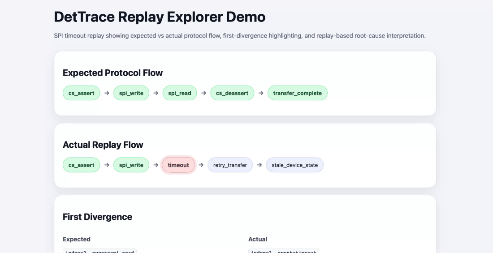

# DetTrace

> First-failure isolation through deterministic replay and incident forensics.

DetTrace is a deterministic replay and divergence analysis tool for isolating the first point of failure in concurrent or distributed execution traces. It turns flaky, ambiguous failures into reproducible evidence by recording expected execution, comparing it against observed behavior, isolating the first divergence point, and preserving artifacts that make debugging and incident reconstruction easier.

---

## Why DetTrace

Distributed and concurrent failures are often easy to observe but hard to explain.

A request fails at the edge. Retries amplify load. A downstream dependency becomes unavailable. Logs show fragments. Later symptoms look noisy and important — but they may not be where the failure actually began.

DetTrace reconstructs those fragments into replayable timelines so you can identify the first failing hop, understand how failure propagated, and compare regressions semantically across runs.

**Questions DetTrace answers:**

- Where did execution first stop matching expectation?
- Which downstream hop failed first?
- Was this a timeout cascade or a retry storm?
- Did failure propagate through request/span lineage?
- Did failover reduce blast radius or create misordered recovery?
- Was this more consistent with DNS, transport, dependency, or latency inflation symptoms?

---

## What It Proves

DetTrace communicates one thing clearly:

**It turns flaky or ambiguous failures into reproducible debugging evidence.**

It does that by combining:

- Deterministic replay
- First-failure isolation
- Divergence analysis
- Replayable incident packs
- Semantic diffing for distributed failures

---


## Control Loop Replay & Divergence Pack

DetTrace includes a replay-based control-loop debugging module for closed-loop behavior analysis under sensor, actuator, and timing faults.

It now supports a control-loop scenario pack with:
- `healthy`
- `delayed_sensor`
- `actuator_saturation`
- `timing_jitter`

### What it simulates

- 2D waypoint tracking
- plant state over time
- controller output over time
- expected vs actual trajectory
- delayed measurements
- dropped sensor samples
- stale state estimates
- actuator saturation
- missed update cycles
- timing jitter

### What it detects

- first divergence step
- first divergence timestamp
- error growth after divergence
- missed deadline count
- controller output clipping
- unstable oscillation
- root-cause classification

### Proof artifacts

- `reports/control_debug_summary.svg`
- `reports/control_scenario_comparison.json`
- `artifacts/control_delayed_sensor_trajectory.svg`
- `artifacts/control_actuator_saturation_trajectory.svg`
- `artifacts/control_timing_jitter_trajectory.svg`
- per-scenario divergence reports and timing-budget summaries

### Current scenario results

- `delayed_sensor` diverges at step `38` / `3.9s`
- `actuator_saturation` diverges at step `53` / `5.4s`
- `timing_jitter` produces `5` missed deadlines without positional divergence
- all faulted scenarios surface replay-based diagnostics and root-cause classes

This makes the control-loop path a visible proof artifact for replay-based closed-loop debugging rather than a hidden simulation.


## Control-Loop Replay

DetTrace includes a separate control-loop replay path for replay-based closed-loop debugging.

### Canonical visual artifact

The control-loop module generates a canonical visual summary in:

- `reports/control_loop_canonical_summary.svg`

It surfaces:
- expected trajectory
- actual trajectory
- first divergence point
- timing-budget misses

### Scenario comparison sheet

The control-loop module generates a scenario comparison sheet in:

- `reports/control_loop_comparison_sheet.json`

Scenarios:
- `healthy`
- `delayed_sensor`
- `dropped_sample`
- `actuator_saturation`
- `timing_jitter`

### Compact diagnostics summary

The control-loop module generates:

- `reports/control_loop_diagnostics_summary.json`

It summarizes:
- first divergence timestamp
- root-cause class
- error growth
- deadline misses
- instability detected (`yes` / `no`)

### What this is

- control-loop replay and debugging
- fault-aware controls analysis
- replay-based divergence detection
- timing-related debugging for closed-loop behavior

### What this is not

- avionics firmware
- a full GNC stack
- embedded flight-control software
- safety-critical flight software claims


## Current Scope

- Deterministic replay for concurrent execution traces
- First-divergence detection with structured reports
- Replay artifact generation for expected, actual, and replayed traces
- 4 replayable distributed incident packs
- 10+ network, transport, and recovery annotations
- OTEL-style span ingestion into a deterministic replay model
- Semantic incident diffing across baseline and candidate runs
- Blast-radius inference across upstream and downstream services
- Operator-style incident reports and runbook guidance
- 2 end-to-end test paths covering original replay and distributed incident analysis

---

## What DetTrace Does

### Core Replay and Divergence Analysis

- Generates an expected concurrent execution trace and validates invariants against it
- Validates execution against an expected ordering during guarded replay
- Detects the **first point of divergence** deterministically
- Saves divergent trace artifacts even when replay throws, preserving failure context
- Produces a structured divergence report identifying the mismatched events

### Distributed Incident Analysis

## Integration Surface

DetTrace accepts:
- event streams
- JSONL execution traces
- OTEL-style spans
- replay packs
- baseline vs candidate incident artifacts


- Reconstructs cross-service timelines using request IDs, span IDs, and parent-span lineage
- Ingests OTEL-style span records into a replayable distributed event model
- Annotates traces with network and transport symptoms
- Replays baseline incident timelines deterministically
- Correlates incidents with deploy and error-burst timing windows
- Infers blast radius across upstream callers and downstream dependencies
- Produces semantic incident diffs and operator-oriented runbook guidance

---

## Debugging Story

A concurrent execution path was failing nondeterministically, but logs alone did not explain why. The system looked healthy at a high level, yet repeated runs produced inconsistent outcomes.

DetTrace recorded the expected execution trace, replayed the run under guard, and isolated the first divergence at event index `5`.

| | |
|---|---|
| **What failed** | A different task was dequeued than the expected schedule required |
| **What was confusing** | The failure appeared intermittent; later symptoms looked more important than the actual root split |
| **What DetTrace revealed** | Execution diverged the moment `TASK_DEQUEUED task=2` appeared where `TASK_DEQUEUED task=1` was expected |

This is the core value of the project: not just showing that something failed, but showing **where the failure actually began**.

---

## Original Replay Example

The original replay path includes a concrete flaky-case walkthrough in `examples/flaky_case_1/`.

Observed first divergence at event index `5`:

```
Expected: TASK_DEQUEUED task=1 worker=0 queue=0
Actual:   TASK_DEQUEUED task=2 worker=0 queue=0
```

DetTrace catches the exact split point deterministically and preserves the divergent trace artifacts for inspection.

### What "event index 5 isolated" means

In plain English: DetTrace found the exact step where execution first stopped matching the expected behavior.

Instead of saying only that the run failed, it showed that the split happened at the 6th recorded event, when the system dequeued the wrong task. Everything after that point may be a downstream consequence rather than the root cause.

---

## First-Divergence Example

**Expected**
```json
{"seq":5,"type":"TASK_DEQUEUED","task":1,"worker":0,"queue":0}
```

**Actual**
```json
{"seq":5,"type":"TASK_DEQUEUED","task":2,"worker":0,"queue":0}
```

What changed:
- The trace diverged at event index `5`
- Task `2` was dequeued where task `1` was expected
- Later failures were downstream effects of this earlier split

---

## Without DetTrace vs. With DetTrace

| Without | With DetTrace |
|---|---|
| Failure appears flaky and inconsistent | Failure becomes replayable |
| Logs show many symptoms but not the first split | First divergence is isolated deterministically |
| Later timeouts and retries obscure root cause | Earliest causal mismatch is preserved as evidence |
| Distributed failures look ambiguous | Incident packs, annotations, and semantic diff make propagation explainable |

---

## Evidence Produced

DetTrace generates debugging artifacts that make failures easier to inspect and compare:

- Expected trace
- Actual trace
- Replayed trace
- Guarded replay trace
- First-divergence report
- Distributed incident replay packs
- Semantic incident diff
- Operator-style incident report

---

## Failure Modes Modeled

| Category | Failure Mode |
|---|---|
| Timeout | Cascading timeouts, timeout chains |
| Retry | Retry storms, retry amplification |
| Transport | TCP connect timeout, transport reset, cancellation propagation |
| Network | DNS failure, latency inflation between hops |
| Dependency | Downstream unavailable, dependency failover edge cases |
| Recovery | Misordered failure recovery |

These are modeled as replayable trace and event streams.

---

## Distributed Incident Pack Example

DetTrace models distributed failure scenarios as replayable incident packs, including:

- Cascading timeouts
- Retry storms
- Misordered recovery
- Dependency failover edge cases

Example progression:

```
dns_failure -> retry -> transport_reset -> retry_burst -> downstream_unavailable -> timeout_chain
```

This makes it possible to replay and compare failure propagation patterns rather than only inspect isolated events.

### Example Incident Topology

```
Client / Edge Proxy
        |
        v
   auth-service   <- first failing service
        |
        v
     token-db     <- downstream impact

Observed signals:
  dns_failure -> retry -> transport_reset -> retry_burst -> timeout_chain

Propagation:
  edge-proxy -> auth-service -> token-db
                |             ^
                +-- retries --+
                       |
                       +-- eventual timeout
```

### Example Incident Report

```json
{
  "incident_family": "retry_storm",
  "timeout_events": 1,
  "retry_events": 2,
  "network_error_events": 2,
  "failover_events": 0,
  "annotations": [
    "dns_failure",
    "transport_reset",
    "retry_burst",
    "downstream_unavailable",
    "latency_inflation_between_hops",
    "timeout_chain"
  ],
  "timeline_correlation": {
    "deploy_correlated": true,
    "suspected_trigger": "recent_deploy",
    "max_latency_ms": 900,
    "error_burst_count": 3
  },
  "blast_radius": {
    "root_service": "auth-service",
    "directly_impacted_services": ["token-db"],
    "upstream_services": ["edge-proxy"]
  }
}
```

---

## Semantic Incident Diff

## Public APIs

Core APIs:
- ingest(events)
- replay(trace)
- diff(expected, actual)
- fingerprint(incident)
- predict_propagation(fingerprint)
- similar_incidents(current)


DetTrace compares baseline and candidate incidents at the service and failure-pattern level, not just raw event mismatch.

```json
{
  "baseline_first_failing_service": "profile-service",
  "candidate_first_failing_service": "auth-service",
  "baseline_first_failure_reason": "tcp_connect_timeout",
  "candidate_first_failure_reason": "dns_failure",
  "retry_delta": 2,
  "timeout_delta": -1,
  "network_error_delta": 2,
  "max_latency_delta_ms": -410
}
```

DetTrace surfaces:

- First failing service changes
- Failure-reason shifts
- Retry amplification deltas
- Timeout and network-error changes
- Latency characteristic changes between runs

This helps distinguish root-cause shifts from downstream symptom changes across runs.

---

## OTEL-Style Ingestion

DetTrace includes a JSONL ingest path that converts span-like records into replayable distributed events.

| Span field | Maps to |
|---|---|
| `trace_id` | `request_id` |
| `span_id` | `span_id` |
| `parent_span_id` | `parent_span_id` |
| `peer_service` | `downstream_service` |
| `start_ms` | `ts_ms` |

This lets DetTrace analyze span-shaped telemetry using the same replay and incident-forensics model.

---

## Quick Start

### Original deterministic replay demo

```bash
./scripts/run_demo.sh
```

This demo:
- Builds the project
- Generates an expected trace
- Runs a divergent execution
- Isolates the first divergence
- Writes a structured divergence report

### Distributed incident replay demo

```bash
./scripts/run_distributed_demo.sh
```

This demo:
- Generates replayable incident packs
- Ingests OTEL-style sample spans
- Annotates network and transport symptoms
- Writes an incident report
- Generates a semantic diff between baseline and candidate runs

### Distributed Demo Outputs

| Output | Path |
|---|---|
| Replay packs | `packs/cascading_timeouts.jsonl`, `packs/retry_storm.jsonl`, `packs/misordered_recovery.jsonl`, `packs/failover_edge.jsonl` |
| Sample ingest | `samples/otel_spans.jsonl` |
| Annotated traces | `artifacts/baseline_annotated.jsonl`, `artifacts/candidate_annotated.jsonl`, `artifacts/otel_ingested_annotated.jsonl`, `artifacts/replayed_distributed.jsonl` |
| Incident report | `reports/distributed_incident_report.json` |
| Semantic diff | `reports/distributed_semantic_diff.json` |

---

## Running Tests

```bash
cmake -B build && cmake --build build
cd build && ctest --output-on-failure
```

End-to-end coverage includes:

- Original flaky replay validation
- Distributed incident replay
- OTEL ingestion
- Annotation checks
- Timeline correlation
- Blast-radius inference
- Semantic diff generation

---

## Swift Companion Analyzer

`dettrace-swift/` is a functional Swift CLI companion for inspecting trace artifacts outside the core C++ runtime.

It reads generated trace files concurrently, compares traces, identifies divergence, produces structured JSON and Markdown reports, and supports repeated artifact inspection workflows during debugging.

```bash
cd dettrace-swift
swift run DetTraceAnalyzer ../artifacts/expected.jsonl ../artifacts/actual.jsonl
```

---

## Diagnostics Viewer

## Who Should Use This

DetTrace is useful for:
- backend teams debugging rare concurrency failures
- platform teams tracing retry storms and causal chains
- release teams comparing baseline vs candidate incident behavior
- reliability engineers isolating root cause before downstream symptoms dominate


A lightweight developer-facing UI in `viewer/` for inspecting execution differences.

It provides:

- Side-by-side diff for passing vs. failing executions
- First-divergence highlighting
- Rule-based root-cause hints
- Invariant status exploration
- Reproducible scenarios and benchmark page

```bash
./scripts/serve_viewer.sh
# -> http://localhost:8000/viewer/index.html
# -> http://localhost:8000/viewer/benchmarks.html
```

---

## Repo Structure

```
analysis/          Divergence detection and invariant checking
trace/             Trace recording and serialization
replay/            Replay engine
examples/
  flaky_case_1/    Concrete ordering-divergence walkthrough
include/dettrace/  Public headers, distributed trace model
src/               Core implementation and distributed incident mode
scripts/           Demo runners and report helpers
tests/
  unit/
  integration/     test_flaky_case_1 + distributed incident replay
  regression/
bench/             Overhead benchmarks
docs/
viewer/            Trace viewer
artifacts/         Generated trace files
packs/             Replayable distributed incident packs
reports/           Divergence and incident reports
samples/           Sample OTEL-style JSONL span input
dettrace-swift/    Swift companion analyzer
```

---

## Operator Runbook Output

DetTrace emits runbook-oriented guidance alongside replay artifacts:

1. Confirm request and span lineage; identify the first failing downstream hop
2. Correlate the incident with recent deploy, health-change, or failover windows
3. Inspect DNS, TCP connect, transport reset, and latency symptoms
4. Evaluate retry backoff and retry amplification
5. Review blast radius before rollback or traffic shift

---


## Debugging Tool for Engineers

DetTrace is a replay-based debugging tool for engineers working on concurrent, distributed, and control-loop systems.

It is designed to make hard failures reproducible, comparable, and diagnosable through:
- deterministic replay
- first-divergence isolation
- semantic comparison across runs
- timing-aware diagnostics
- replay artifacts that preserve root-cause evidence

### Canonical visual artifact

DetTrace generates a visual control-loop artifact showing:

- expected trajectory
- actual trajectory
- divergence point

Key artifact:
- `reports/control_loop_canonical_summary.svg`

### Diagnostics summary

DetTrace generates compact diagnostics summaries such as:

- First divergence: step `38`
- Root cause: `delayed_measurement`
- Error growth after divergence: `0.903344`
- Deadline misses: `5`
- Instability detected: `true`

Key artifact:
- `reports/control_loop_diagnostics_summary.json`

### Scenario comparison table

DetTrace compares healthy and faulted runs through scenario packs.

| Scenario | Stable? | Divergence | Cause |
|---|---|---|---|
| healthy | yes | none | - |
| delayed_sensor | no | step 38 | delayed measurement / dropped sample |
| actuator_saturation | no | step 53 | actuator saturation |
| timing_jitter | no | timing-budget failure | timing jitter / missed deadlines |

Key artifact:
- `reports/control_loop_comparison_sheet.json`

### What this is

- control-loop debugging tool
- replay-based analysis system
- first-divergence isolation tool
- timing-aware diagnostics workflow

### What this is not

- avionics firmware
- flight control system
- full GNC stack
- safety-critical flight software claim


## Incident Intelligence Engine

DetTrace now includes a **cross-incident learning layer** on top of replay-driven forensics.

It does not just isolate divergence inside a single run. It also:

- fingerprints incidents from replay artifacts
- finds similar historical failures across scenario packs
- surfaces recurring failure patterns
- predicts likely propagation paths from first divergence onward

### New proof statement

**Learns recurring failure patterns across incidents and predicts failure propagation paths before they fully unfold.**

### What it uses

- first divergence position
- divergence class
- affected components
- propagation shape
- symptom terms
- causal-chain artifacts

### New artifacts

- `artifacts/reports/incident_fingerprints.json`
- `artifacts/reports/cross_incident_learning.md`
- `artifacts/reports/propagation_predictions.json`

### Example positioning

A retry storm with first divergence at event `2` can now be fingerprinted, compared against prior timing- and dependency-related failures, and used to predict likely downstream propagation through auth and gateway paths before the terminal symptom fully unfolds.

## Incident Forensics

### Proof statement

**Replay-driven incident forensics tool that isolates first divergence, reconstructs causal behavior drift, and explains how faults become operator-visible failures.**

### Why replay matters

- logs often show aftermath
- replay reveals drift onset
- first divergence is more actionable than terminal symptom
- causal reconstruction beats symptom-only debugging

### Scenario packs

DetTrace includes curated scenario packs:

- `timeout_chain`
- `retry_storm`
- `stale_state`
- `delayed_dependency`
- `duplicate_ack`
- `misordered_recovery`

Each scenario produces:

- expected healthy trace
- degraded trace
- replay trace
- scenario notes
- divergence report
- root cause report
- incident report
- causal chain
- invariant breaks
- propagation view

### Semantic divergence taxonomy

DetTrace classifies divergence into categories such as:

- timing divergence
- ordering divergence
- missing event
- duplicate event
- stale-state transition
- retry amplification
- timeout chain
- recovery misordering

### Invariant-guided replay

DetTrace checks invariants such as:

- no duplicate completion without retry
- no action before dependency-ready
- recovery must follow failure within N steps
- ack ordering must preserve causality

### Human-readable reports

Key elite artifacts:

- `artifacts/reports/scenario_summary.md`
- `artifacts/reports/incident_cards.md`
- `artifacts/reports/cluster_summary.json`
- per-scenario `divergence_report.json`
- per-scenario `root_cause_report.json`
- per-scenario `incident_report.md`
- per-scenario `causal_chain.md`

### Ambiguity and confidence

DetTrace reports likely causes with confidence and alternative hypotheses rather than pretending certainty when trace evidence is incomplete.


## Positioning

DetTrace is a specialist debugging and incident-forensics tool for making hard failures reproducible, inspectable, and explainable.

It is not a packet sniffer, not a router-control framework, and not a full observability platform. Its value is in making distributed failure sequences replayable, comparable, and explainable.

---

## License

MIT

---

## Comparison with Existing Tools

| Tool | Focus | Deterministic Replay | Concurrency Analysis | Output |
|------|------|---------------------|---------------------|--------|
| rr (Mozilla) | Full process replay | Yes | Low-level | Instruction-level |
| Valgrind Helgrind | Data race detection | No | Yes | Race warnings |
| DetTrace | Event-level replay & divergence | Yes | Yes | First divergence + causal trace |

DetTrace focuses on **semantic divergence**, not just low-level execution or race detection.

---


---

## Swift Analysis Layer (DetTraceAnalyzer)

DetTrace includes a Swift-based analysis engine using:

- async/await concurrency
- actor isolation for state safety

### Why Swift?

- Structured concurrency simplifies trace processing
- Actor model prevents analysis-time race conditions
- Aligns with modern Apple systems engineering practices

The Swift analyzer produces:

- divergence_report_swift.json
- human-readable markdown reports

This separation allows:
- C++ for execution
- Swift for safe analysis

---


---

## Real Bug Case Studies

- [Duplicate Dequeue Race Condition](docs/case-studies/duplicate-dequeue.md)

Concrete examples demonstrate how DetTrace isolates real concurrency failures.

---


---

## Quick Demo (10 seconds)

```bash
git clone https://github.com/kritibehl/dettrace
cd dettrace
./scripts/run_demo.sh
This will:

Build the system
Run a deterministic replay
Show the first divergence
Output trace artifacts


---

## Scenario Packs

DetTrace includes scenario-pack folders for concurrency and recovery failures:

- `timeout_chain`
- `retry_storm`
- `stale_state`
- `delayed_dependency`
- `duplicate_ack`
- `misordered_recovery`

Run all scenario packs:

```bash
./scripts/run_scenarios.sh
Artifacts are stored under:

artifacts/scenario_runs/<scenario_name>/

This makes failure replay easier to demonstrate, compare, and preserve across runs.


---

## Metrics and Benchmark Output

Collect one-run artifact metrics:

```bash
./scripts/collect_metrics.py
Run repeated benchmark passes:

./scripts/benchmark_runs.sh 10

Generated outputs:

artifacts/benchmarks/metrics_summary.json
artifacts/benchmarks/run_metrics.csv
artifacts/benchmarks/benchmark_summary.json

Tracked metrics include:

expected event count
actual event count
replayed event count
first divergence index
artifact presence across runs


---

## Incident Fingerprinting

DetTrace can classify failure patterns into reusable fingerprints.

Example output:

```json
{
  "incident_fingerprint": "retry_pattern_timeout_chain",
  "features": ["retry_pattern", "timeout_chain"]
}
This enables:

grouping similar failures
detecting recurring patterns
cross-incident learning


---

## Incident Intelligence

Run the full incident-intelligence pipeline:

```bash
./scripts/run_incident_intelligence.sh
This pipeline:

builds and runs DetTrace
collects artifact metrics
generates an incident fingerprint
predicts failure propagation paths
compares the current failure to prior saved incidents
stores the current run in incident history

Key outputs:

artifacts/benchmarks/incident_fingerprint.json
artifacts/benchmarks/propagation_prediction.json
artifacts/benchmarks/similar_incidents.json
artifacts/history/incident_<timestamp>.json

Example questions DetTrace can now answer:

"What was the first divergence?"
"What type of failure pattern is this?"
"What might this failure become downstream?"
"Does this look like a previous outage?"
Why Swift for the Analysis Layer

The Swift companion is intentionally separate from the C++ execution core.

C++ drives event generation and replay
Swift handles analysis with async/await and actor isolation

This makes the analysis layer easier to extend for:

structured postmortems
safe concurrent artifact processing
operator-facing report generation
Positioning

DetTrace is a deterministic replay and incident-intelligence project for concurrency failures.

It is built to show:

first-divergence isolation
preserved replay artifacts
semantic failure comparison
cross-incident learning
propagation-aware analysis


---

## Real Bug Case Study: Duplicate Dequeue Race

### Scenario
Two workers attempt to dequeue tasks during a narrow ownership handoff window.

### Expected Behavior
- Worker A → Task 1  
- Worker B → Task 2  

### Actual Behavior
- Worker A → Task 1  
- Worker B → Task 1  
- Task 2 is delayed or skipped  

### First Divergence (Detected by DetTrace)
Event index: 5

Expected:
{type=TASK_DEQUEUED, task=1, worker=0, queue=0}

Actual:
{type=TASK_DEQUEUED, task=2, worker=0, queue=0}

### Root Cause
Queue ownership update was not serialized with dequeue visibility.

### Why DetTrace Matters
The visible failure appeared later as duplicate work and inconsistent queue progress.

DetTrace identified the earlier semantic divergence instead of the downstream symptom.

---


---

## Where DetTrace Fits

| Tool | Focus | Strength | Limitation | How DetTrace Differs |
|------|------|----------|------------|---------------------|
| rr | Record/replay debugger | Low-level replay, reverse debugging | No semantic failure modeling | DetTrace isolates *semantic divergence* |
| Helgrind | Data race detection | Finds synchronization bugs | No replay or causality reconstruction | DetTrace reconstructs failure timelines |
| DetTrace | Deterministic replay + incident intelligence | First divergence + artifacts + pattern learning | Narrower scope | Focused on causality, not just execution |

DetTrace is not a replacement for rr or Helgrind.  
It operates at the **semantic event level**, not instruction level.

---


---

## Example: Failure Propagation

```json
{
  "predicted_failure_propagation_path": [
    "work_distribution_skew",
    "duplicate_processing",
    "queue_pressure"
  ],
  "estimated_blast_radius": "local",
  "risk_level": "medium"
}
Interpretation
Divergence changes which worker receives work
Leads to duplicate or skipped tasks
Causes downstream queue pressure

DetTrace answers:

"What broke?" → "What will this break next?"


---

## DetTrace++: Distributed Incident Forensics Platform

DetTrace++ extends the replay core into a distributed incident forensics platform.

### Added platform capabilities
- Event ingestion API for traces and logs
- Multi-service replay timeline
- First-divergence detection across services
- Retry storm detection
- Timeout chain detection
- Incident fingerprinting and clustering
- Root cause explanation engine
- Historical failure memory
- Visual timeline UI

### Run locally

```bash
cd dettrace_platform
./scripts/run_platform.sh
In a second terminal:

cd dettrace_platform
./scripts/load_case_studies.sh

Then open:

http://127.0.0.1:8010/docs
http://127.0.0.1:8010/incidents

For a visual timeline, use the incident id returned by /ingest:

http://127.0.0.1:8010/timeline/<incident_id>
Killer case studies
race-condition-bug
retry-storm-meltdown
cascading-failure
Why this matters

This turns DetTrace from a replay engine into a system that can ingest, compare, explain, and remember distributed failures.

---

## Incident Packs

DetTrace includes polished incident packs under `incident_packs/`:

- `duplicate_dequeue_race`
- `retry_storm_chain`
- `misordered_recovery`

These are designed to make replay, semantic diffing, propagation analysis, and historical comparison easy to demonstrate.

---

## Event Schema

Minimal required fields are documented for:

- event replay
- span lineage
- semantic diffing

See:
- `docs/schema/event_replay.md`
- `docs/schema/span_lineage.md`
- `docs/schema/semantic_diffing.md`

---

## CLI / API Modes

CLI commands:
- `replay`
- `diff`
- `fingerprint`
- `compare-incidents`

API mode remains available through the DetTrace++ platform.

---

## Historical Incident Memory

DetTrace persists fingerprints and similarity rankings across runs so repeated failures can be clustered and compared over time.

---

## Incident Pack Gallery

DetTrace ships with incident packs that make failure modes concrete:

- `incident_packs/retry_storm`
- `incident_packs/race_condition`
- `incident_packs/cascading_failure`

These packs document the symptom, invisible root cause, and the DetTrace analysis surface for each failure type.

---

## Visual Timeline Example

A distributed timeout chain can be reconstructed as a service timeline:

```text
frontend -> search-service -> ranking-service -> feature-store -> timeout
DetTrace uses this timeline to show where downstream symptoms began and where the incident first stopped being correct.

---

## CLI

```bash
cd dettrace_platform
./bin/dettrace analyze case_studies/retry_storm_meltdown.json
./bin/dettrace replay case_studies/race_condition_bug.json

---

## AutoOps Integration

DetTrace can be used as a downstream incident-analysis engine for AutoOps.

Example result:

```json
{
  "root_cause": "retry amplification",
  "first_divergence": "service A retry loop"
}

---

## First-Divergence Visualization

DetTrace exposes the first semantic break directly:

```json
{
  "first_divergence_index": 1,
  "expected": { "event_type": "commit" },
  "actual": { "event_type": "dequeue" },
  "divergence_type": "cross_service_event_mismatch"
}
This surfaces the exact moment a system stopped being correct under concurrency or timing stress.


---

## Firmware-Style Validation Scenario

DetTrace replays hardware/software interaction traces for a virtual UART interrupt flow, comparing expected MMIO/register/interrupt ordering against actual execution and isolating the first divergence when firmware and peripheral behavior stop matching.

### Event model
- register_write
- register_read
- irq_assert
- irq_clear
- isr_enter
- isr_exit
- tx_fifo_empty
- tx_fifo_push

### Scenarios
- `uart_interrupt_nominal.json`
- `uart_interrupt_stuck_irq.json`

### What DetTrace shows
- expected register/interrupt sequence
- actual observed sequence
- first divergence index
- likely reason:
  - missing irq clear
  - stale status bit
  - unexpected write ordering

This is trace-driven hardware/software interaction replay, not hardware emulation.


---

## Firmware Trace Replay Pack

DetTrace includes a firmware-style trace replay pack for low-level event ordering validation.

### Scenarios
- UART stuck interrupt
- Timer missed tick
- GPIO interrupt race
- Register write ordering mismatch

### DetTrace surfaces
- first divergence index
- expected vs actual event
- likely reason:
  - stale status bit
  - missing irq_clear
  - wrong ordering
  - missed tick

This extends DetTrace beyond distributed failures into trace-driven firmware-style debugging without claiming hardware emulation.


---

## Failure Sequence Comparison

DetTrace makes first-divergence debugging readable at a glance.

### GPIO Interrupt Race

**Expected**
```text
irq_assert → isr_enter → gpio_ack
Actual

gpio_edge → register_read → isr_exit

First divergence: index 3

Timer Missed Tick

Expected

irq_assert → isr_enter → tick_handle

Actual

tick_miss → register_read → isr_exit

First divergence: index 1

This lets reviewers immediately see where execution stopped matching the correct sequence.


---

## Firmware Trace Replay

DetTrace includes firmware-style trace replay for low-level event ordering validation.

It can compare expected vs actual interrupt and register sequences across scenarios such as:
- UART stuck interrupt
- Timer missed tick
- GPIO interrupt race
- Register write ordering mismatch

Example:

**Expected**
```text
irq_assert → isr_enter → irq_clear
Actual

tick_miss → register_read → isr_exit

First divergence: index 1

This extends DetTrace beyond distributed failures into trace-driven firmware-style debugging without claiming hardware emulation.


---

## OpenTelemetry Span Ingestion

DetTrace can ingest OpenTelemetry-style span payloads and convert them into replayable event timelines.

This allows span data to be analyzed using:
- first-divergence detection
- replay bookmarks
- divergence snapshots
- structured failure tags
- trace search
- incident reconstruction

Example:

```bash
curl -X POST http://127.0.0.1:8010/ingest/otel \
  -H "Content-Type: application/json" \
  --data @dettrace_platform/case_studies/otel/retry_storm_spans.json
Timeline Export, Bookmarks, Snapshots, and Search

DetTrace exposes incident timelines as structured exports:

GET /timeline-export/{incident_id}

Timeline exports include:

replay timeline
first-divergence bookmark
divergence snapshot
structured failure tags
full incident analysis

Trace search:

GET /search?q=retry
GET /search?tag=retry_storm

These features make DetTrace usable as a debugging and observability workflow, not only a replay engine.


---

## Logs vs Traces vs Replay

| Signal | What it shows | What it misses | DetTrace value |
|---|---|---|---|
| Logs | Local symptoms and messages | Causal ordering across services | Reconstructs execution flow |
| Traces | Cross-service request paths | Expected vs actual divergence | Converts spans into replayable timelines |
| Replay | What happened vs what should have happened | Requires structured event model | Isolates first divergence and failure propagation |

DetTrace complements logs and traces by reconstructing where execution first stopped matching the correct behavior.


---

## OpenTelemetry Retry-Storm Example

Input:

```bash
curl -X POST http://127.0.0.1:8010/ingest/otel \
  -H "Content-Type: application/json" \
  --data @/tmp/otel_request.json

Output:

{
  "incident_fingerprint": "retry_storm_timeout_chain",
  "retry_count": 4,
  "timeout_chain_events": 5,
  "root_cause": "checkout-service entered a retry storm against payment-service"
}

Timeline export:

GET /timeline-export/{incident_id}

Search:

GET /search?tag=retry_storm


---

## Replay Bookmarks and Divergence Snapshots

Timeline exports include structured debugging aids:

```json
{
  "bookmarks": [
    {
      "label": "first_divergence",
      "index": 1,
      "reason": "cross_service_event_mismatch"
    }
  ],
  "divergence_snapshots": [
    {
      "type": "divergence_snapshot",
      "expected": { "event_type": "irq_assert" },
      "actual": { "event_type": "tick_miss" }
    }
  ],
  "failure_tags": ["retry_storm", "timeout_chain"]
}

These make replay output searchable, reportable, and usable during incident review.


---

## Demo Commands

Start DetTrace++:

```bash
cd dettrace_platform
uvicorn app.main:app --host 127.0.0.1 --port 8010
Ingest OpenTelemetry retry-storm trace:

curl -X POST http://127.0.0.1:8010/ingest/otel \
  -H "Content-Type: application/json" \
  --data @/tmp/otel_request.json

View incident report:

curl http://127.0.0.1:8010/report/<incident_id>

Search retry-storm incidents:

curl "http://127.0.0.1:8010/search?tag=retry_storm"

Compare expected vs actual firmware event sequence:

curl http://127.0.0.1:8010/sequence-compare/<incident_id>


---

## Deployment, CI, and Observability Proof

DetTrace includes lightweight platform proof for local deployment and validation:

- Dockerfile for containerized FastAPI runtime
- docker-compose service for local API deployment
- GitHub Actions workflow for API + OTEL + firmware replay validation
- `/metrics` endpoint for incident counts, fingerprints, and failure tags
- Terraform skeleton documenting service deployment variables

This does not claim enterprise-scale production infrastructure; it proves deployability, CI validation, and observability-oriented service design.

---

## Production-Minded Proof

DetTrace includes engineering hygiene beyond the core replay engine:

- API contract documentation
- Dockerized FastAPI runtime
- docker-compose local service deployment
- GitHub Actions workflow validation
- API workflow tests
- OTEL ingestion validation
- firmware sequence divergence validation
- `/metrics` endpoint
- benchmark script for ingestion latency
- generated incident reports
- security and production-readiness notes
- Makefile for repeatable test / benchmark / Docker workflows

This keeps the project honest: DetTrace is not claimed as a production-scale service, but it demonstrates production-minded platform engineering around replay-driven debugging.

---

## Production-Minded Proof

DetTrace includes engineering hygiene beyond the core replay engine:

- API contract documentation
- Dockerized FastAPI runtime
- docker-compose local service deployment
- GitHub Actions workflow validation
- API workflow tests
- OTEL ingestion validation
- firmware sequence divergence validation
- `/metrics` endpoint
- benchmark script for ingestion latency
- generated incident reports
- security and production-readiness notes
- Makefile for repeatable test / benchmark / Docker workflows

This keeps the project honest: DetTrace is not claimed as a production-scale service, but it demonstrates production-minded platform engineering around replay-driven debugging.

---

## Device Event Replay Pack

DetTrace includes a C++17 device-event replay proof pack for device-level debugging scenarios.

The pack models trace-driven events such as:

- button_press
- sensor_read
- network_packet_received
- device_state_change
- firmware_timer_tick
- interrupt_asserted
- interrupt_cleared

It reports:

- first divergence index
- expected state
- actual state
- probable defect type
- reproduction steps

Example defect:

```text
Expected: interrupt_cleared -> READY
Actual:   sensor_read -> WAITING
First divergence: index 4
Probable defect: missing_interrupt_clear
This is trace-driven device-event replay, not hardware emulation.

---

## C-Compatible Replay Result Interface

DetTrace includes a small C-compatible replay-result interface around the C++17 device-event replay output.

Files:

- `device_replay/replay_result.h`
- `device_replay/replay_result.c`
- `device_replay/replay_c_api_demo.c`

This exposes:

```c
typedef struct ReplayResult {
    int first_divergence_index;
    const char* expected_event;
    const char* actual_event;
    const char* expected_state;
    const char* actual_state;
    const char* probable_defect_type;
} ReplayResult;

The interface is intentionally small and demonstrates C/C++ interoperability for debugging outputs without claiming embedded firmware deployment.

---

---

---

## Device Replay Build and Automation

The device replay proof pack includes command-line build and replay workflows.

### Run replay workflows

```bash
make -C device_replay run
python3 device_replay/run_replay_suite.py
Python replay suite

The automation suite runs:

C++17 device replay
C-compatible replay-result demo
failing trace validation
corrected trace validation
JSON defect summary generation
Markdown defect summary generation
Failing-to-passing replay example

The replay workflow demonstrates a missing interrupt-clear defect at divergence index 4 and a corrected trace that restores the expected execution path.

Failing replay:

expected_event: interrupt_cleared
actual_event: sensor_read
probable_defect_type: missing_interrupt_clear

Corrected replay:

status: PASS
first_divergence_index: none


---

## Serial / RPC / Network Failure Replay Pack

DetTrace includes simulated replay packs for serial, RPC, DNS, and network-partition failures:

- serial disconnect
- RPC timeout chain
- DNS retry storm
- network partition / heartbeat timeout

These packs strengthen trace-driven debugging coverage for device-cloud and networked service workflows.

They are simulated replay artifacts, not production infrastructure traces.

---

## Apple-Oriented Debugging Proofs

DetTrace includes additional debugging proof packs for systems and validation roles:

- replay timeline UI with divergence highlighting
- concurrency replay cases for race conditions, double-locks, deadlocks, and shared-state corruption
- symbolic replay explanation examples with likely subsystem and confidence score
- simulated macOS-style stack trace comparison and symbolized replay report

These are simulated debugging artifacts designed to demonstrate replay-driven failure analysis, not production Apple integrations.

---

## Visual Replay Timeline UI

DetTrace includes a visual replay timeline under `ui/replay_timeline/`.

The UI shows:

- expected vs actual event sequences
- first-divergence highlighting
- race-condition replay diff
- deadlock timeout-chain graph
- root-cause panels with affected subsystem and confidence score

This makes replay analysis easier to inspect during debugging and validation workflows.

---

## Swift, Crash Parsing, and Protocol Debugging Additions

DetTrace includes additional lightweight proof artifacts for systems debugging roles:

- Swift replay-report parsing CLI
- XCTest-style parser test example
- Git commit bisection workflow over actual repository history
- Radar-style bug triage template
- crash log / stack trace parser
- HTTP/TCP/DNS/TLS replay scenario
- gRPC/RPC lifecycle timeout scenario
- Go context cancellation timeout scenario
- service health and connection-pool diagnostic scenario

These are simulated debugging artifacts intended to demonstrate tooling familiarity and replay-driven diagnosis, not production Apple or networking infrastructure ownership.

---

## Final Validation Proofs

DetTrace includes additional Apple- and QA-oriented validation artifacts:

- XCTest-style replay validation examples
- simulated symbolicated crash comparison
- stack-frame diff report
- API contract replay validation
- schema mismatch detection
- regression summary generation

These artifacts demonstrate validation, crash triage, and contract-testing familiarity without claiming production Apple tooling or enterprise API ownership.

---

## Replay Session Export

DetTrace includes a recruiter-readable replay session export under `exports/`.

Files:

- `exports/replay_session_001.json`
- `exports/replay_html_report.html`

The export summarizes:

- first-divergence evidence
- expected vs actual replay state
- replay-based root-cause panel
- protocol timeout-chain replay
- crash-frame mismatch
- validation artifacts

This is intended as a compact proof packet for debugging, QA, and systems-tooling review.

---

## gRPC Lifecycle Replay and Bug Triage

DetTrace includes a simulated gRPC lifecycle replay pack and Apple-style bug triage docs.

Files:

- `dettrace_platform/case_studies/protocol_replay/grpc_timeout_lifecycle.json`
- `docs/grpc_lifecycle_debugging.md`
- `bug_triage/xcode_style_bug_report.md`
- `bug_triage/regression_repro_steps.md`

This adds proof for RPC lifecycle debugging, service communication failure analysis, reproducible bug reports, and Apple-style QA communication.

---

## Protocol Timing Notes

DetTrace includes software-level protocol timing notes under `protocol_timing/`.

Files:

- `protocol_timing/heartbeat_timeout_window.md`
- `protocol_timing/timing_jitter_analysis.json`

These artifacts document heartbeat timeout windows, timing jitter observations, first-divergence evidence, and protocol sequencing failures.

This is trace-driven software timing validation, not electrical signal-integrity analysis.

---

## Device Diagnostics and Command-Line Replay Inspection

DetTrace includes additional diagnostics-oriented artifacts for product validation and device lifecycle debugging.

### Hardware-interface diagnostic simulation

Files under `hardware_diag/` model:

- I2C timeout traces
- USB reconnect behavior
- PCIe-style enumeration flow
- device probe sequencing

These are software trace simulations, not driver/kernel/firmware implementations.

### Command-line replay inspection

`tools/replay_inspect_cli.py` supports:

```bash
python3 tools/replay_inspect_cli.py inspect-trace hardware_diag/i2c_timeout_trace.json
python3 tools/replay_inspect_cli.py show-divergence hardware_diag/i2c_timeout_trace.json
python3 tools/replay_inspect_cli.py show-timeouts hardware_diag/i2c_timeout_trace.json
python3 tools/replay_inspect_cli.py show-retries hardware_diag/i2c_timeout_trace.json
Device-health diagnostics

Files under device_diag/ document unhealthy subsystem detection, timeout handling, reconnect recovery, degraded state, and recovery validation.

Swift command-line parser

swift_tools/DeviceReplayCLI.swift parses replay session exports and prints divergence/root-cause summaries.

---

## Hardware Diagnostic Test-Spec Matrix

DetTrace includes a compact diagnostics review matrix at:

- `device_diag/hardware_test_spec_matrix.md`

The matrix maps diagnostic scenarios to:

- expected device behavior
- observable failure signal
- replay evidence
- validation command
- pass/fail criteria

This supports diagnostics review workflows using simulated replay artifacts, without claiming hardware lab, firmware, driver, or manufacturing-system ownership.

---

## Mock Instrument Measurement Validation

DetTrace includes a mock instrument-data validation workflow under `instrumentation_demo/`.

Files:

- `instrumentation_demo/mock_instrument_capture.json`
- `instrumentation_demo/instrument_data_parser.py`
- `instrumentation_demo/instrument_validation_report.json`
- `instrumentation_demo/measurement_validation_report.md`

The workflow parses structured measurement samples and detects:

- missing measurements
- incomplete capture windows
- out-of-range sensor values
- calibration drift warnings
- retry events
- degraded device states

This is a mock hardware-adjacent diagnostic workflow, not laboratory instrument control or physical measurement automation.

---

## Runtime Replay Cases

DetTrace includes small runtime-debugging replay cases under `runtime_replay_cases/`.

Files:

- `runtime_replay_cases/cache_fallback_trace.json`
- `runtime_replay_cases/invalid_branch_target_trace.json`
- `runtime_replay_cases/runtime_divergence_report.md`

These cases compare expected versus observed interpreter-style execution traces for cache fallback and invalid branch-path behavior.

Safe scope: runtime trace replay and first-divergence debugging. This does not claim VM implementation, JIT compiler work, compiler backend work, or production runtime optimization.

---

## SystemVerilog FIFO Verification Lab

DetTrace includes a small hardware-adjacent verification proof under `systemverilog_fifo_lab/`.

The lab documents:

- verification planning
- directed testbench workflows
- assertion coverage
- corner-case validation
- reset/full/empty/overflow/underflow behavior

This is intended as a verification-learning and validation artifact, not production ASIC verification infrastructure.

---

## Diagnostics / Developer-Tools Expansion Pack

DetTrace includes lightweight trace-based diagnostics artifacts for systems and developer-tools workflows:

- SPI-style transfer timeout replay
- CAN-style message-drop replay
- replay latency trace summaries
- flamegraph-style performance notes
- syscall-style trace replay
- process timeline visualization notes
- LLDB/GDB-style replay debugging workflow
- simple CLI replay explorer

Safe scope: these are replay and diagnostics artifacts. They do not claim driver development, firmware ownership, kernel engineering, eBPF implementation, production perf tooling, or debugger plugin development.

---

---

---

## Replay Explorer Demo

DetTrace includes a visual replay timeline demo:

- `reports/trace_timeline.html`

The demo shows a SPI-style timeout case with:

- expected protocol flow
- actual replay flow
- first-divergence highlighting
- probable defect type
- replay-based recovery action
- safe embedded-adjacent diagnostic framing

Case study:

- `case_studies/spi_timeout_first_divergence.md`

Run the CLI replay explorer:

    python3 tui/replay_explorer.py protocol_diag/spi_transfer_timeout.json

### Replay Timeline Demo

SPI timeout replay visualization:



The replay explorer highlights:

- expected vs actual protocol flow
- first-divergence detection
- timeout propagation
- stale device state transitions
- replay-based recovery interpretation
