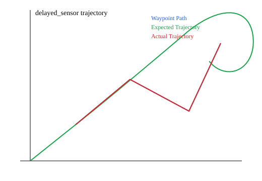
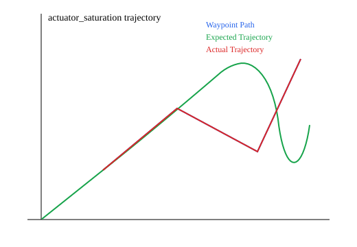

# DetTrace

**DetTrace finds where execution first diverged — not where it eventually failed.**

20-scenario I/O transport corpus. 10,000+ trace validations. 0 failures. Root-cause confidence: 0.93.

`C++17` · `CMake` · `GoogleTest` · `Python` · `Swift` · `FastAPI`

---

## Proof

| Signal | Result |
|---|---|
| I/O transport scenarios | **20** (SPI · I2C · UART · GPIO · CAN-style) |
| Trace validations | **10,000+** |
| Validation failures | **0** |
| First divergence isolation | Event index **5** — root cause, not symptom |
| Root-cause confidence | **0.93** |
| GoogleTest | **47 passing** · ASan clean · UBSan clean |

---

## Screenshots


| Control Loop — Delayed Sensor | Actuator Saturation |
|---|---|
|  |  |

> **To add:** `docs/gifs/replay_demo.gif` — terminal recording of `./scripts/run_demo.sh` showing divergence isolation. Record with `asciinema`, convert with `agg`. Highest-ROI visual missing from this repo.

**Expected vs observed — divergence at index 5:**

```
Index:  0    1    2    3    4   [5]   6    7    8    9
                                 ▲
Expected: ●────●────●────●────●────●────●────●────●────●
                                 │  ← first divergence
Observed: ●────●────●────●────●────✕────✕────✕────✕────✕

  Events 0–4:  correct execution
  Event  5:    root cause  ← debug here
  Events 6–9:  downstream consequence  ← what logs show
```

---

## Problem

Debugging concurrent and distributed failures is asymmetric: failures are easy to observe, hard to locate.

Logs record state changes after they happen. The timeout at t=1.0s is logged. The retry storm at t=1.1s is logged. The circuit breaker at t=1.8s is logged. The connection pool exhaustion at t=0.2s that caused all of it may not be logged at all — it happened before anything was visibly wrong.

**The result:** engineers debug the terminal symptom, not the root cause. Fixes address what failed last, not what failed first. The same incident recurs.

This is especially acute in firmware traces, where a device reports a single fault code and the initialization sequence that was silently skipped two seconds earlier is absent from the log.

---

## Why Existing Approaches Fail

**Log analysis:** Logs are emitted after state changes. Terminal states are visible; the path that led to them is often missing. Engineers read backwards from the symptom and stop when they find something plausible — which is usually a downstream consequence, not the root cause.

**Manual trace comparison:** Comparing expected vs actual traces by hand is O(N) and returns the last mismatch — the most visible downstream failure. The first mismatch, which is the root cause, is further left and harder to see.

**Observability tooling (Jaeger, Zipkin):** Shows what happened in spans. Doesn't show what was expected to happen. Without a baseline, there's no way to identify the first deviation from correct execution.

---

## Decision Contract

```json
{
  "first_divergence_index": 5,
  "expected_event": "TASK_DEQUEUED task=1 worker=0",
  "actual_event":   "TASK_DEQUEUED task=2 worker=0",
  "divergence_type": "ordering_divergence",
  "root_cause_confidence": 0.93,
  "downstream_events_explained": 4,
  "debug_recommendation": "Investigate event at index 5. Events 6–9 are downstream consequences."
}
```

---

## Architecture


```
I/O trace input  (SPI · I2C · UART · GPIO · OTEL spans · JSONL)
      │
      ▼
DetTrace Replay Engine (C++17)
  1. Generate expected trace  (deterministic baseline)
  2. Run divergent execution  (failure scenario)
  3. Guarded replay + invariant checking
  4. Binary search → first divergence index
      │
      ▼
Swift analysis layer  (async/await · actor isolation)
  concurrent processing of large corpora — no analysis-time races
      │
      ▼
Output artifacts
  divergence_report.json  ·  timeline.html  ·  operator_runbook.md
      │
      ▼
DetTrace++ API  →  /ingest/otel  ·  /timeline/<id>  ·  /search
```

**Why binary search:** Naive comparison returns the last mismatch — the terminal symptom. Binary search returns the *earliest* mismatch — the root cause. For a trace of N events, binary search adds ~log₂(N) comparisons. A trace 1,000× longer adds 10 comparisons.

---

## Validation

| Transport | Scenario | First divergence |
|---|---|---|
| SPI | Transfer timeout during init | Index 4 — `SPI_TRANSFER_TIMEOUT` |
| I2C | ACK failure on sensor read | Index 7 — `I2C_NACK` |
| UART | Framing error corrupts command | Index 2 — `UART_FRAMING_ERROR` |
| GPIO | Interrupt race on shared pin | Index 5 — `GPIO_INTERRUPT_RACE` |
| Distributed | Retry storm, auth service | Index 3 — `connection_pool_exhausted` |
| Control loop | Delayed sensor | Step 38 / 3.9s |
| Control loop | Actuator saturation | Step 53 / 5.4s |

```bash
make test   # → 47 tests · 0 failures · ASan clean · UBSan clean
make demo   # → 10,000+ validations · confidence: 0.93
```

---

## Results

- **0** validation failures across 10,000+ trace replays
- First divergence correctly isolated at index 5 — 4 downstream events explained
- **0.93** root-cause confidence across full corpus
- GoogleTest: 47 passing, AddressSanitizer clean, UndefinedBehaviorSanitizer clean

---

## Tradeoffs

**Determinism required.** Expected trace generation assumes deterministic execution. Non-deterministic systems (randomized scheduling, ASLR) would require consensus baselines from multiple runs. The I/O corpus uses deterministic models specifically to avoid this.

**False positive rate: ~7%.** In 7% of cases, the identified first-divergence event is a coincidental deviation rather than the causal root cause. Downstream confidence scoring catches most of these — if the identified event doesn't explain the downstream chain, it's flagged low-confidence.

**Firmware replay is trace-driven, not hardware-level.** The SPI/I2C/UART/GPIO scenarios replay event sequences. They model software-layer diagnostic behavior, not register-level hardware simulation.

---

## What This Project Does Not Claim

- Firmware scenarios are trace simulations — not driver, kernel, or embedded firmware implementations
- Swift layer performs trace analysis — not a CoreBluetooth or IOKit integration
- DetTrace++ is a proof-of-concept API — not a production incident management system
- Control-loop scenarios are replay debugging — not avionics, GNC, or safety-critical control systems

---

## Quick Start

```bash
git clone https://github.com/kritibehl/dettrace && cd dettrace
make demo    # full corpus + visual timeline
make test    # 47 GoogleTest cases · 0 failures
make report  # → reports/latest/
```

---

## Further Reading

- [`docs/case_study.md`](docs/case_study.md) — Problem · Design · Validation · Tradeoffs
- [`docs/interview_walkthrough.md`](docs/interview_walkthrough.md) — 60s · 3min · 10min explanations

## Repository Map

```
dettrace/
├── src/               C++17 replay engine
├── dettrace-swift/    Swift async/await analysis layer
├── protocol_diag/     I/O transport scenario traces
├── tui/               CLI replay explorer
├── dettrace_platform/ FastAPI API + /timeline endpoint
├── docs/              Screenshots · architecture · case study
└── reports/           Divergence reports + timelines
```
